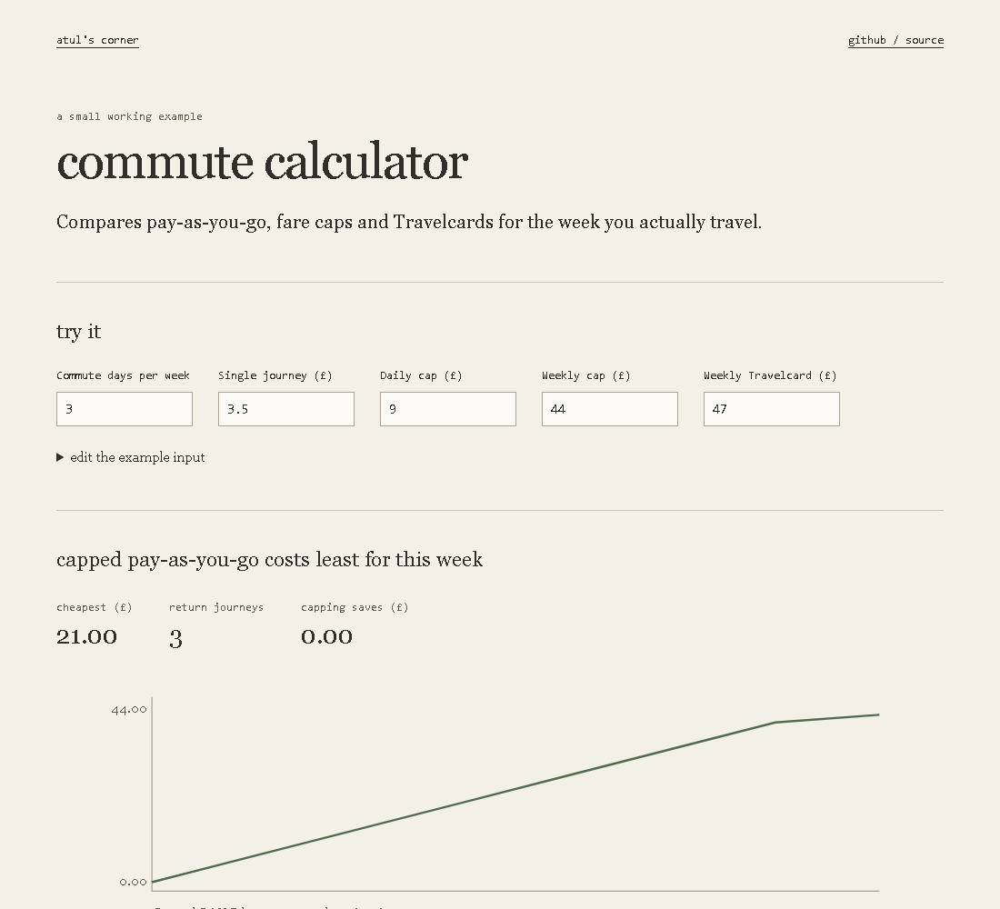

# commute calculator

Compares pay-as-you-go, fare caps and Travelcards for the week you actually travel.

<!-- working-example:start -->
## Try it in a minute

**[Live example](https://lolstar123.github.io/london-commute-calculator/)** · [Example code](examples/portfolio/model.mjs) · [Run locally](examples/portfolio/README.md) · [Atul's website](https://atul-kanodia-fieldnotes.atulswaggalicious.chatgpt.site)

Change commute days and fares; compare capped PAYG with a weekly ticket.



<!-- working-example:end -->

## The project

Enter your journey and working pattern, then compare ticket costs with daily and weekly caps. The full calculator also handles zones, peak times, Railcards, annual leave and break-even points.

Working from home changes which ticket is worth buying.

## Find your way around

| Path | What is here |
| --- | --- |
| [examples/portfolio](examples/portfolio) | Runnable browser example and fixtures |
| [model.mjs](examples/portfolio/model.mjs) | Actual calculation or workflow |
| [model.test.mjs](examples/portfolio/model.test.mjs) | Reproducible checks and edge cases |
| [PROVENANCE.md](PROVENANCE.md) | How this example relates to the full project |
| [AGENTS.md](AGENTS.md) | Instructions for extending the example |

## Quick start

```sh
python -m http.server 8000 --directory examples/portfolio
node --test examples/portfolio/model.test.mjs
```

Open http://localhost:8000. No dependencies, accounts or API keys needed.

## What is included

The mini example uses editable illustrative fares. The full original includes dated fare tables; check current TfL prices before buying.
