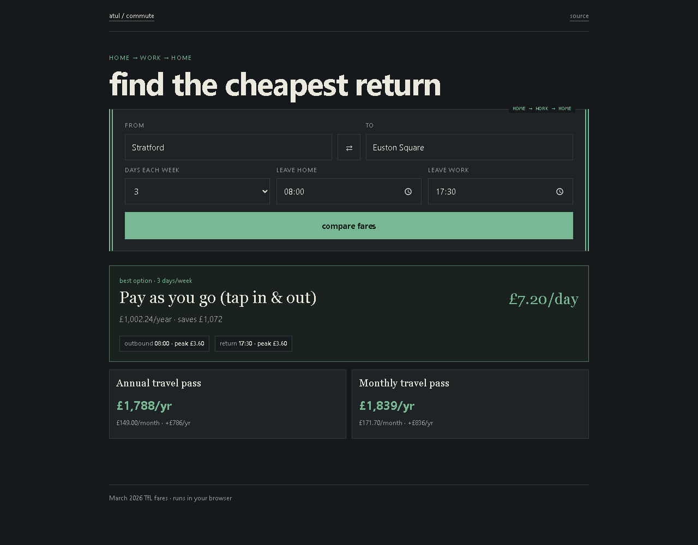

# London commute calculator

[Open the calculator](https://lolstar123.github.io/london-commute-calculator/) | [Application source](examples/portfolio/index.html) | [Fare provenance](PROVENANCE.md)

Compare PAYG with weekly, monthly and annual Travelcards for a home-to-work-to-home journey. Enter both departure times: an off-peak return can change the cheapest payment method even when the outward trip stays at peak rates.



## Try a journey

1. Search for your home and work stations. Suggestions include the station's zone; use the arrow keys and Enter, or choose a suggestion.
2. Set your commuting days per week and the times you leave home and work. The swap control reverses the stations.
3. Choose **Compare fares**. The result names the lowest annual cost, its cost per commuting day and the next two cheapest options.

The starting example is Stratford to Euston Square, three days a week, leaving at 08:00 and returning at 17:30. It is an example journey, not a claim about the author's commute. Both leg prices remain visible as **PAYG** comparisons even when a pass wins.

Unknown stations, identical endpoints and missing times do not produce a fare recommendation. Journey inputs are saved in this browser; no account or remote journey service is involved.

## Understand the estimate

The bundled fare tables are dated **March 2026**. They are not fetched from a live fare API. Verify current fares and the exact route before buying, particularly for Heathrow, National Rail and journeys beyond Zone 6.

This focused view compares one return journey per day, one to five commuting days per week, no Railcard and no extra bus trips. Its annual comparison assumes **5.6 weeks off**, leaving **46.4 commuting weeks**:

| Payment method | Annual comparison |
| --- | --- |
| PAYG | Both leg fares, daily/weekly caps, then commuting weeks |
| Weekly Travelcard | Bundled weekly price multiplied by commuting weeks |
| Monthly Travelcard | Bundled monthly price multiplied by the equivalent commuting months |
| Annual Travelcard | Full bundled annual price |

The displayed per-day amount divides annual cost by commuting days. Monthly figures follow the ticket rule: PAYG, weekly and annual options show annual cost divided by twelve, whereas the monthly Travelcard shows its bundled monthly price. The model chooses the smallest zone span for boundary stations; it does not search real routes or prove a journey avoids Zone 1. Pass comparisons use fractional commuting periods rather than optimising purchase dates.

The unchanged advanced application remains in [`original/`](original/) for its wider controls. Its bundled data has the same dated-fare boundary.

## Run locally

Use Python and a modern browser. No install step, API key or login is needed for the calculator.

```sh
python -m http.server 8000 --directory examples/portfolio
```

Open **http://localhost:8000**. Station search and fare comparison work offline once these files are served.

## Check the application

The browser audit was run with Python 3.11 and isolated Chrome:

```sh
python -m pip install playwright
python tools/browser_audit.py
```

Windows uses installed Google Chrome. On Linux/macOS, first run `python -m playwright install chromium`. Checks cover the default journey, days and return-time recalculation, swap, invalid/same stations, empty times, keyboard autocomplete, focus and 1280px/390px layouts. Evidence is saved to ignored `output/qa/`.

## Code map

| Path | Responsibility |
| --- | --- |
| `examples/portfolio/index.html` | Interface, embedded station names/zones, bundled fare tables and calculation functions |
| `examples/portfolio/style.css` | Return-ticket layout, recommendation and responsive input states |
| `examples/portfolio/london-stations.js` | Companion station/mode reference; the current app uses its embedded `ST` records |
| `original/london-commute-optimizer.html` | Preserved advanced calculator |
| `tools/browser_audit.py` | Real-browser regression checks and screenshot capture |
| `DESIGN.md` | Visual direction, tokens and acceptance checklist |
